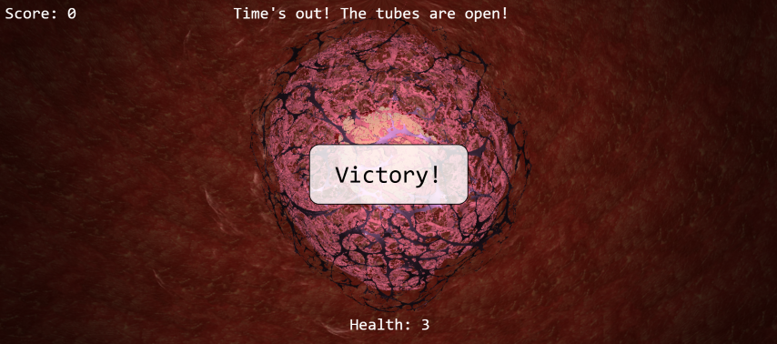
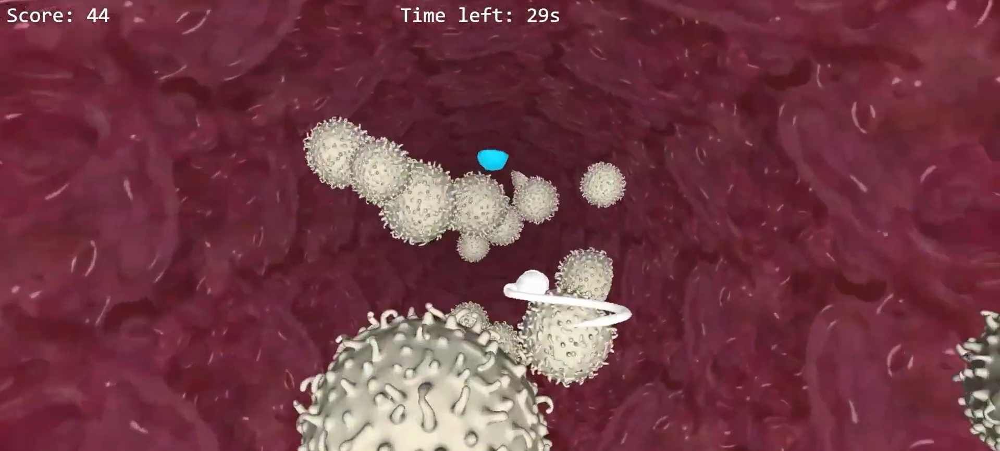
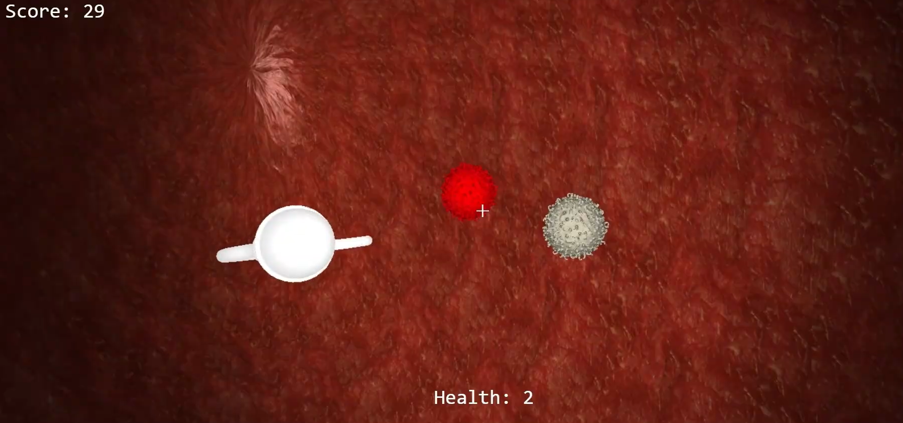

<p align="center">
  
</p>

# 💦 Sperm Splash: Our First Journey

**In the race to life, millions enter, but only one survives. And in Sperm Splash, that one could be you! - if you’ve got the balls.**

**Sperm Splash** is a 3D game where you guide a sperm cell on an epic journey through the female reproductive system - dodging threats, shooting enemies and progressing through multiple levels to reach the egg.

**[Click here](https://drive.google.com/file/d/11v_VrIfis3DHuoMHTtqmJce_LdEvhJkj/view)** to watch the full **Technical Walkthrough** & **Gameplay**!



---

## 🕹️ Game Modes

* **Story Mode:** Follow the biological journey from start to finish. Your goal is to clear both levels, survive the hazards, and successfully reach the egg to complete the mission. It’s the full "chosen one" experience.
* **Survival Mode:** There is no finish line and no egg to reach. Your only objective is to survive for as long as possible against endless waves of enemies. Dodge, shoot, and fight to beat your previous high score before the inevitable end.

---

## 🧬 The Levels

### Level 1 - Vag Crash 🏃‍♂️
A high-stakes dash through the vaginal canal.


* **Dodge:** White blood cells don't like uninvited guests.
* **Endure:** 60 seconds of pure adrenaline (in Story Mode).
* **Evolve:** Speed increases. Patience decreases.
* **Power-ups:** Grab the Shield (5s) to turn the tables - crashing into enemies while shielded nets you extra points.

### Level 2 - Uterus Splash 🔫
A tactical First-Person Shooter inside the uterus.


* **Combat:** White blood cells are damage sponges. Rival sperm cells are fast but die in one hit.
* **Health:** You have 3 HP. Use them wisely.
* **The Grand Finale:** Survive the countdown, reach the Fallopian Gates, and gamble on a **50/50** chance. Choose the wrong side, and well... you can always restart the level.

---

## ⚙️ Technical Aspects

### Real-Time State Management
The game loop updates player movement, enemy behavior, timers, score, health, and power-up effects every frame to keep gameplay responsive and deterministic. Story and Survival modes share core systems, while each level applies its own rules and pacing through separate scene logic.

### Collision Physics
Collision handling is tuned for fast arcade gameplay: continuous position updates, proximity checks between entities, and immediate resolution on contact (damage, destruction, shield interaction, or score changes). This keeps interactions readable at high speed and avoids delayed hit feedback.

### Resource Optimization in Browser
To sustain smooth performance in a browser-based 3D environment, assets are preloaded, render work is minimized per frame, and entities are reused where possible to avoid unnecessary allocations. This reduces CPU/GPU spikes, helps maintain stable frame times, and improves consistency across devices.

---

## ⌨️ Controls

### Menus
* **Mouse:** Click to choose your path (or your doom).

### Level 1 (Vag Crash)
* `Arrow Up / Down / Left / Right`: Basic survival movement.

### Level 2 (Uterus Splash)
* **Click on canvas:** Lock your pointer (aim like a pro).
* `Mouse`: Aim.
* `Left Click`: Shoot bursts of hope.
* `W A S D`: Movement.
* `Space`: Ascend.
* `Left Shift`: Descend.

---

## 🚀 How To Launch The Mission

### Option 1: VS Code Live Server
1. Open the project folder in VS Code.
2. Click **Go Live** on `index.html`.

### Option 2: The Python Classic
Run this from the project root:
```bash
python -m http.server 8000
```

After starting the server, open your browser and go to:

`http://localhost:8000`


